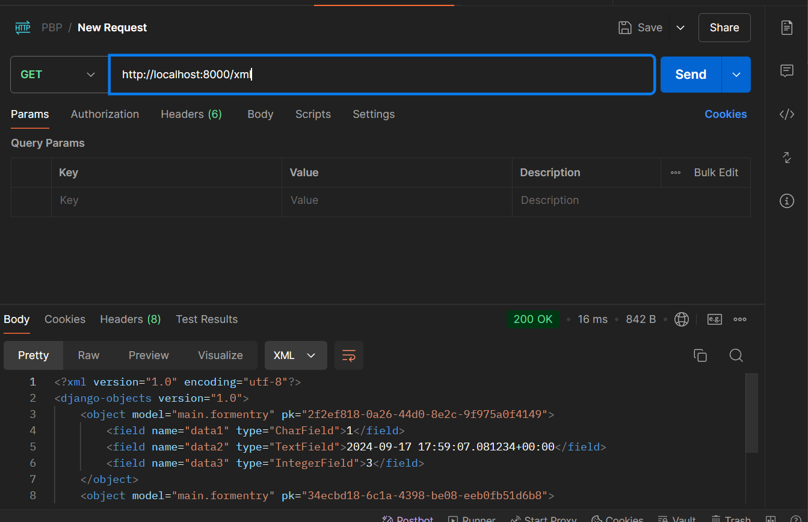
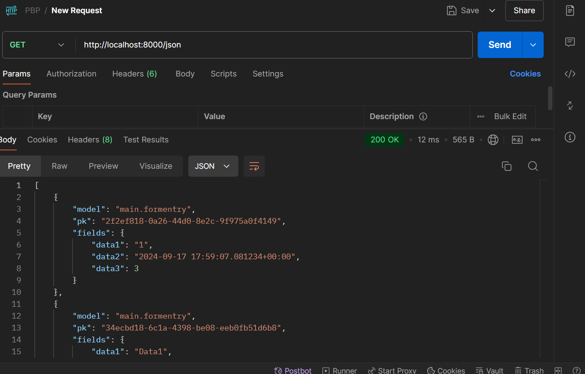
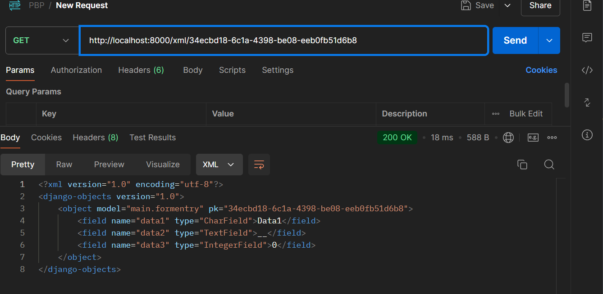
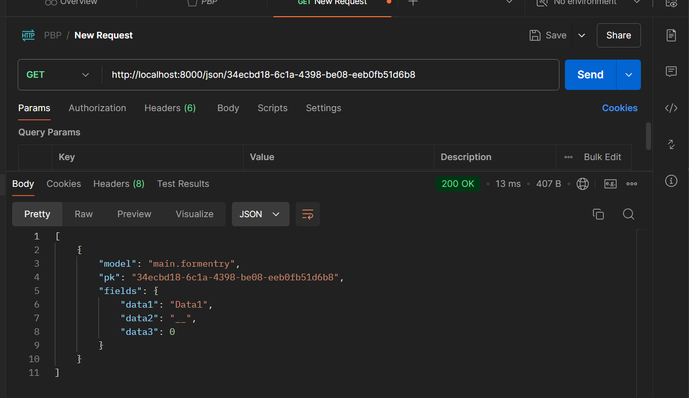

# Assignment_4_PBP

### What is the difference between HttpResponseRedirect() and redirect()?

The main difference between `HttpResponseRedirect()` and `redirect()` in Django is that `HttpResponseRedirect()` is a lower-level function used to create a redirect response by passing the target URL explicitly, whereas `redirect()` is a shortcut that automatically determines the URL to redirect to based on the arguments provided, such as a URL name, a view name, or a model instance. Both ultimately perform a redirection, but `redirect()` simplifies the process by handling different types of input.

### Explain how the MoodEntry model is linked with User

The `MoodEntry` model is linked to the `User` model through a foreign key relationship. Each `MoodEntry` instance has a `user` field that references a specific user, allowing multiple mood entries to be associated with one user. If the user is deleted, all related mood entries are also removed, ensuring data integrity.

### What is the difference between authentication and authorization, and what happens when a user logs in? Explain how Django implements these two concepts.

Authentication verifies a user's identity, ensuring they are who they claim to be, typically through credentials like a username and password. When a user logs in, Django checks the provided credentials against stored data. If they match, Django authenticates the user and creates a session, allowing access to the application.

Authorization, on the other hand, determines what an authenticated user is allowed to do. After logging in, Django uses permissions and groups to control access to views and resources. Users can be assigned specific permissions, and views can restrict access based on these permissions, ensuring that users can only perform actions they are authorized to do.

### How does Django remember logged-in users? Explain other uses of cookies and whether all cookies are safe to use.

Django remembers logged-in users through sessions, which are stored on the server side. When a user logs in, Django creates a session and assigns a unique session ID, which is sent to the user's browser as a cookie. On subsequent requests, the browser returns this cookie to the server, allowing Django to identify the user and maintain their logged-in state.

Cookies can also serve various purposes, such as storing user preferences, tracking analytics, managing shopping carts, and implementing user-specific features. However, not all cookies are safe to use. They can be intercepted or manipulated if not secured properly, and using the `Secure` and `HttpOnly` flags can help mitigate these risks. Additionally, cookies can track user behavior across sites, raising privacy concerns. Unvalidated cookie data can also lead to vulnerabilities, such as session hijacking. It is essential to implement proper security measures when using cookies to protect user data and privacy.

### Explain how did you implement the checklist step-by-step (apart from following the tutorial).
I add the new function in view to have the login and logout. Updated the templates with a new html file and update also the main file. All of this is possible because of the function and object django provide to us to implement a login and logout.

# Assignment_3_PBP

### Explain why we need data delivery in implementing a platform.

Data delivery in a Django project is crucial because it allows users to interact with the platform by retrieving and displaying information from the database. It supports dynamic content, API integration, scalability, and ensures secure handling of data across the system.

### In your opinion, which is better, XML or JSON? Why is JSON more popular than XML?

JSON is generally considered better for modern applications because it's simpler, more lightweight, and easier for both humans and machines to read and write. JSON's structure is more aligned with data types in most programming languages, making it easier to parse and manipulate. It became more popular than XML due to its minimal syntax and efficiency, especially for web APIs and data exchange in modern web applications.

###  Explain the functional usage of is_valid() method in Django forms. Also explain why we need the method in forms.

The is_valid() method in Django forms checks if the form's data is valid based on the defined field types and validation rules. It returns `True` if all fields pass validation and `False` otherwise. It also populates the form's `cleaned_data` attribute with the validated data for further processing.
We need this method to ensure that the user input is correct before saving or processing it, preventing invalid or harmful data from entering the system and maintaining data integrity.

### Why do we need csrf_token when creating a form in Django? What could happen if we did not use csrf_token on a Django form? How could this be leveraged by an attacker?

The `csrf_token` in Django forms is needed to protect against Cross-Site Request Forgery (CSRF) attacks. It ensures that the form submission comes from the legitimate site and not from an external malicious source. Without `csrf_token`, attackers could create malicious forms or links that trick users into submitting unauthorized requests to your site (e.g., changing account details, performing unwanted actions). An attacker could exploit this by embedding hidden forms in a malicious website, which users unknowingly submit while authenticated to your site, leading to unauthorized actions being performed.

### Explain how you implemented the checklist above step-by-step (not just following the tutorial).

I implemented a new model for the form object, made the fonction in view to links and see different information and the template and finally the routing with urls.

## Postman Screenshots :

### /xml

### /json

### /xml/[ id ]

### json/[ id ]

-------------------------------------

# Assignment_2_PBD
Assignement week 2 Platform base dev

### Explain how you implemented the checklist above step-by-step (not just following the tutorial)
1.    To implement the checklist, I first created a GitHub repository and cloned it locally. Then, I set up a new Django project and created a "main" app, adding it to `INSTALLED_APPS` in `settings.py`. I added a `Product` model with attributes like `name`, `price`, and `description`, then built a simple template with CSS for better styling. After that, I created a view to render the template and set up the necessary URL routing in `urls.py` to ensure the correct pages were displayed.
### Create a diagram that contains the request client to a Django-based web application and the response it gives, and explain the relationship between urls.py, views.py, models.py, and the html file.

2.

The client sends an HTTP request to the Django application. The request is received by urls.py, which routes it to the appropriate view in views.py. The view in views.py processes the request, interacting with models.py if necessary to access or manipulate data. After processing, views.py renders the appropriate HTML template, injecting any required data into it. Finally, the rendered HTML template is sent back to the client as an HTTP response, completing the request-response cycle.

### Explain the use of git in software development!

3. Git is a version control system widely used in software development to manage and track changes to code over time. Git allows multiple developers to collaborate on the same project by keeping track of every modification made to the source code. With that tool, each developer can work independently on different features or bug fixes in separate branches without interfering with the main codebase. Once their work is complete, they can merge their changes back into the main branch. Git also provides a history of all changes, making it easy to revert to previous versions if necessary and to understand the evolution of a project. With all of that git as a tool make the collaboration, organization, and management of software projects way easier. 
 
### In your opinion, out of all the frameworks available, why is Django used as the starting point for learning software development?

4. Django is often chosen as a starting point for learning software development because it's a high-level framework that simplifies many common tasks, allowing beginners to focus on core concepts. It enables you to build a full application from front to back without needing multiple technologies or environments. Following the "batteries-included" philosophy, Django comes with built-in features like authentication, URL routing, and an admin panel, allowing developers to create apps quickly without fully understanding how these tools work. However, it's still important to grasp the basics of how this "magic" operates. Additionally, Django encourages clean, organized code through its Model-View-Template (MVT) architecture and promotes good development practices. Its detailed documentation and strong community support make it especially beginner-friendly.

### Why is the Django model called an ORM ? 

5. The Django model is called an ORM _(Object-Relational Mapping)_ because it allows developers to interact with the database using Python objects instead of writing SQL queries. The ORM automatically translates Python code into SQL commands and maps database tables to Python classes, making it easier to manage and manipulate data in a more intuitive and object-oriented way. This abstraction simplifies database operations and allows developers to work at a higher level of abstraction without dealing directly with SQL.

