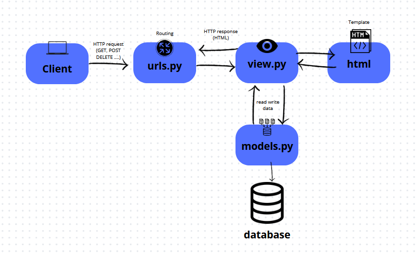

# Assignement_6_PBP

### Explain the benefits of using JavaScript in developing web applications!

JavaScript is essential in web development because it allows for creating dynamic, interactive user interfaces without needing to reload the page. This improves user experience by enabling real-time content updates, such as form validation or live search. It runs natively in all browsers, ensuring cross-platform compatibility on desktops and mobile devices. And it's very versatil as we can code in js for back-end to with nodejs.

### Explain why we need to use await when we call fetch()! What would happen if we don't use await?

We use await when calling fetch() because fetch() returns a Promise, which represents an asynchronous operation. The await keyword tells JavaScript to pause execution until the Promise resolves, allowing us to handle the data once it is available. Without await, the code will continue executing without waiting for fetch() to complete, potentially leading to issues where the data is not yet available when you try to use it. 

### Why do we need to use the csrf_exempt decorator on the view used for AJAX POST?

The csrf_exempt decorator is used on a Django view handling an AJAX POST request to disable CSRF (Cross-Site Request Forgery) protection for that specific view. By default, Django includes CSRF protection on all POST requests to prevent malicious websites from making unauthorized requests on behalf of users.

When you send an AJAX POST request, if the CSRF token is not included in the request, Django will block the request and raise a 403 Forbidden error. The csrf_exempt decorator tells Django to skip CSRF validation for that view, allowing the AJAX POST request to go through without requiring a valid CSRF token.
It’s also important to note that disabling CSRF protection reduces security. 

### On this week's tutorial, the user input sanitization is done in the back-end as well. Why can't the sanitization be done just in the front-end?

Sanitizing user input only in the front-end is not enough because it can be bypassed. Users can manipulate or disable front-end validation, for example, by using browser developer tools or sending requests directly to the server. If sanitization is only done on the front-end, malicious input could still reach the back-end, potentially leading to security vulnerabilities like SQL injection or XSS (Cross-Site Scripting). Therefore, sanitization must also be done on the back-end to ensure all input is secure, regardless of how it was submitted.

###  Explain how you implemented the checklist above step-by-step (not just following the tutorial)!

To implement this checklist, I primarily used JavaScript with AJAX in the main.html file to handle GET and POST requests, so I added the necessary functions and created the events for the modal. I also modified the view to include a new function for managing AJAX requests and linked it to the URLs and templates. I also added the  strip_tags utils from Django to avoid Cross-Site Scripting.

# Assignement_5_PBP

###  If there are multiple CSS selectors for an HTML element, explain the priority order of these CSS selectors!

When multiple CSS selectors are applied to an HTML element, the browser determines which rule to apply based on specificity. Specificity follows a hierarchy where inline styles have the highest priority, meaning styles applied directly within an HTML element (e.g., style="color:red;") will override any other styles. The next in line are ID selectors, which apply to elements that are identified with a unique ID (e.g., #header). Following IDs, class selectors, pseudo-classes (e.g., :hover), and attribute selectors are considered. Finally, element selectors like div, p, or h1 have the lowest specificity. In cases where two or more rules have the same specificity, the one that appears last in the CSS will be applied, giving it precedence over the others.

### Why does responsive design become an important concept in web application development? Give examples of applications that have and have not implemented responsive design!

Responsive design has become crucial in web development as it ensures that websites and applications function optimally on a variety of devices, particularly those with different screen sizes. This concept is vital because users access web applications on a range of devices, from smartphones and tablets to desktops, and the design must adjust accordingly. Responsive design enhances user experience, providing a consistent look and feel across all devices. 

### Explain the differences between margin, border, and padding, and how to implement these three things!

Margin, border, and padding are three distinct properties in CSS that control the space around and within an element. The margin is the space outside the border of an element, used to create distance between the element and neighboring elements. The border is the visible line or outline that surrounds the padding and content of the element, giving it a defined boundary. Padding is the space between the content of the element and its border, used to create internal spacing within the element. 

### Explain the concepts of flex box and grid layout along with their uses!

Flexbox and grid layout are two CSS tools that help design layouts in a more efficient and structured way. Flexbox is a layout model that allows elements to align and distribute space within a container in a single dimension, either in rows or columns. It is particularly useful for creating flexible and responsive designs where items need to align or space themselves relative to others, such as in navigation bars or horizontally aligned content. On the other hand, the grid layout is a two-dimensional system that allows for the placement of elements in rows and columns. It provides greater control over both horizontal and vertical alignment, making it ideal for complex layouts, such as those seen in dashboards or galleries where multiple rows and columns are needed. Both layout methods help in creating responsive designs that adjust seamlessly across devices and screen sizes.

### Explain how you implemented the checklist above step-by-step (not just following the tutorial)!

To implement the checklist, I created a new HTML file to be used in other components such as the navbar and the card. I also added the edit and delete functions in the view, linking them in the URLs and HTML to enable the delete and edit buttons. Finally, I added CSS to style the website pages.

# Assignment_4_PBP

### What is the difference between HttpResponseRedirect() and redirect()?

The main difference between `HttpResponseRedirect()` and `redirect()` in Django is that `HttpResponseRedirect()` is a lower-level function used to create a redirect response by passing the target URL explicitly, whereas `redirect()` is a shortcut that automatically determines the URL to redirect to based on the arguments provided, such as a URL name, a view name, or a model instance. Both ultimately perform a redirection, but `redirect()` simplifies the process by handling different types of input.

### Explain how the MoodEntry model is linked with User

The `MoodEntry` model is linked to the `User` model through a foreign key relationship. Each `MoodEntry` instance has a `user` field that references a specific user, allowing multiple mood entries to be associated with one user. If the user is deleted, all related mood entries are also removed, ensuring data integrity.

### What is the difference between authentication and authorization, and what happens when a user logs in? Explain how Django implements these two concepts.

Authentication verifies a user's identity, ensuring they are who they claim to be, typically through credentials like a username and password. When a user logs in, Django checks the provided credentials against stored data. If they match, Django authenticates the user and creates a session, allowing access to the application.

Authorization, on the other hand, determines what an authenticated user is allowed to do. After logging in, Django uses permissions and groups to control access to views and resources. Users can be assigned specific permissions, and views can restrict access based on these permissions, ensuring that users can only perform actions they are authorized to do.

### How does Django remember logged-in users? Explain other uses of cookies and whether all cookies are safe to use.

Django remembers logged-in users through sessions, which are stored on the server side. When a user logs in, Django creates a session and assigns a unique session ID, which is sent to the user's browser as a cookie. On subsequent requests, the browser returns this cookie to the server, allowing Django to identify the user and maintain their logged-in state.

Cookies can also serve various purposes, such as storing user preferences, tracking analytics, managing shopping carts, and implementing user-specific features. However, not all cookies are safe to use. They can be intercepted or manipulated if not secured properly, and using the `Secure` and `HttpOnly` flags can help mitigate these risks. Additionally, cookies can track user behavior across sites, raising privacy concerns. Unvalidated cookie data can also lead to vulnerabilities, such as session hijacking. It is essential to implement proper security measures when using cookies to protect user data and privacy.

### Explain how did you implement the checklist step-by-step (apart from following the tutorial).
I add the new function in view to have the login and logout. Updated the templates with a new html file and update also the main file. All of this is possible because of the function and object django provide to us to implement a login and logout.

# Assignment_3_PBP

### Explain why we need data delivery in implementing a platform.

Data delivery in a Django project is crucial because it allows users to interact with the platform by retrieving and displaying information from the database. It supports dynamic content, API integration, scalability, and ensures secure handling of data across the system.

### In your opinion, which is better, XML or JSON? Why is JSON more popular than XML?

JSON is generally considered better for modern applications because it's simpler, more lightweight, and easier for both humans and machines to read and write. JSON's structure is more aligned with data types in most programming languages, making it easier to parse and manipulate. It became more popular than XML due to its minimal syntax and efficiency, especially for web APIs and data exchange in modern web applications.

###  Explain the functional usage of is_valid() method in Django forms. Also explain why we need the method in forms.

The is_valid() method in Django forms checks if the form's data is valid based on the defined field types and validation rules. It returns `True` if all fields pass validation and `False` otherwise. It also populates the form's `cleaned_data` attribute with the validated data for further processing.
We need this method to ensure that the user input is correct before saving or processing it, preventing invalid or harmful data from entering the system and maintaining data integrity.

### Why do we need csrf_token when creating a form in Django? What could happen if we did not use csrf_token on a Django form? How could this be leveraged by an attacker?

The `csrf_token` in Django forms is needed to protect against Cross-Site Request Forgery (CSRF) attacks. It ensures that the form submission comes from the legitimate site and not from an external malicious source. Without `csrf_token`, attackers could create malicious forms or links that trick users into submitting unauthorized requests to your site (e.g., changing account details, performing unwanted actions). An attacker could exploit this by embedding hidden forms in a malicious website, which users unknowingly submit while authenticated to your site, leading to unauthorized actions being performed.

### Explain how you implemented the checklist above step-by-step (not just following the tutorial).

I implemented a new model for the form object, made the fonction in view to links and see different information and the template and finally the routing with urls.

## Postman Screenshots :

### /xml

### /json

### /xml/[ id ]

### json/[ id ]

-------------------------------------

# Assignment_2_PBD
Assignement week 2 Platform base dev

### Explain how you implemented the checklist above step-by-step (not just following the tutorial)
1.    To implement the checklist, I first created a GitHub repository and cloned it locally. Then, I set up a new Django project and created a "main" app, adding it to `INSTALLED_APPS` in `settings.py`. I added a `Product` model with attributes like `name`, `price`, and `description`, then built a simple template with CSS for better styling. After that, I created a view to render the template and set up the necessary URL routing in `urls.py` to ensure the correct pages were displayed.
### Create a diagram that contains the request client to a Django-based web application and the response it gives, and explain the relationship between urls.py, views.py, models.py, and the html file.

2.

The client sends an HTTP request to the Django application. The request is received by urls.py, which routes it to the appropriate view in views.py. The view in views.py processes the request, interacting with models.py if necessary to access or manipulate data. After processing, views.py renders the appropriate HTML template, injecting any required data into it. Finally, the rendered HTML template is sent back to the client as an HTTP response, completing the request-response cycle.

### Explain the use of git in software development!

3. Git is a version control system widely used in software development to manage and track changes to code over time. Git allows multiple developers to collaborate on the same project by keeping track of every modification made to the source code. With that tool, each developer can work independently on different features or bug fixes in separate branches without interfering with the main codebase. Once their work is complete, they can merge their changes back into the main branch. Git also provides a history of all changes, making it easy to revert to previous versions if necessary and to understand the evolution of a project. With all of that git as a tool make the collaboration, organization, and management of software projects way easier. 
 
### In your opinion, out of all the frameworks available, why is Django used as the starting point for learning software development?

4. Django is often chosen as a starting point for learning software development because it's a high-level framework that simplifies many common tasks, allowing beginners to focus on core concepts. It enables you to build a full application from front to back without needing multiple technologies or environments. Following the "batteries-included" philosophy, Django comes with built-in features like authentication, URL routing, and an admin panel, allowing developers to create apps quickly without fully understanding how these tools work. However, it's still important to grasp the basics of how this "magic" operates. Additionally, Django encourages clean, organized code through its Model-View-Template (MVT) architecture and promotes good development practices. Its detailed documentation and strong community support make it especially beginner-friendly.

### Why is the Django model called an ORM ? 

5. The Django model is called an ORM _(Object-Relational Mapping)_ because it allows developers to interact with the database using Python objects instead of writing SQL queries. The ORM automatically translates Python code into SQL commands and maps database tables to Python classes, making it easier to manage and manipulate data in a more intuitive and object-oriented way. This abstraction simplifies database operations and allows developers to work at a higher level of abstraction without dealing directly with SQL.

